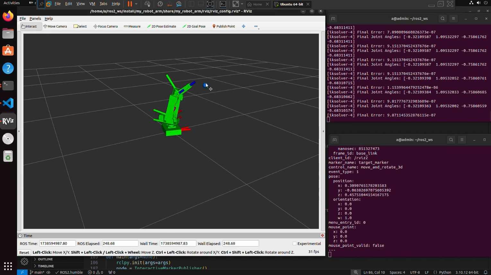
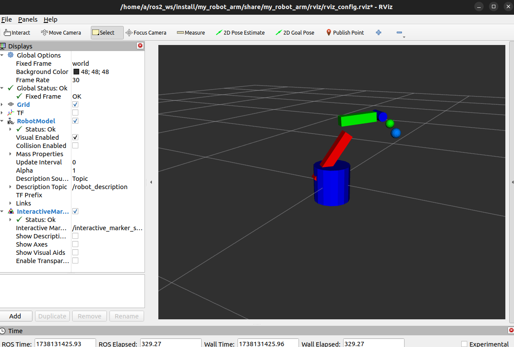

# Inverse Kinematics Solver for 4-DOF Robot Arm (ROS2)



A ROS2-based project demonstrating **real-time control and simulation** of a custom **4-DOF robotic arm** using inverse kinematics (IK).  
The arm is controlled via **interactive markers in RViz**, allowing users to move the end-effector in 3D space while the solver calculates and updates joint positions.

---

## 🚀 Features
- **4-DOF Robotic Arm** – Base, shoulder, elbow, and wrist joints designed for smooth and precise control.  
- **Inverse Kinematics Solver** – Computes joint angles to reach any target pose within the arm’s workspace.  
- **ROS2 Integration (Humble)** – Built with ROS2, making it compatible with modern robotics systems.  
- **Interactive RViz Control** – Use drag-and-drop interactive markers to position the end-effector.  
- **URDF Model with Custom Meshes** – A visually detailed and physically accurate robot model.

---

## 📹 Demo Videos

**1. IK Solver in Action (version 1)**  
[](https://youtu.be/b1hVl7t81uQ)

**2. Motion Planning Showcase**  
[](https://youtu.be/3FyhsID-Q4M)

*(Click images to watch the videos on YouTube.)*

---

## 🛠 Requirements
- ROS2 Humble
- Python 3.x
- RViz2 (for visualization)
- URDF-based robot model
- ROS2 packages:
  - `interactive_markers`
  - `geometry_msgs`

---

## 🔧 Installation

1. **Clone the repository:**
    ```bash
    git clone https://github.com/Abhi-creator1/RobotArm-IKdsolver.git
    mv RobotArm-IKdsolver my_robot_arm
    ```

2. **Install dependencies:**
    Ensure ROS2 Humble is installed and sourced:
    ```bash
    source /opt/ros/humble/setup.bash
    sudo apt install ros-humble-interactive-markers ros-humble-geometry-msgs
    ```

3. **Build the workspace:**
    ```bash
    colcon build --symlink-install
    ```

4. **Source the workspace:**
    ```bash
    source install/setup.bash
    ```

5. **Run the project:**
    ```bash
    ros2 launch my_robot_arm display.launch.py
    ```

---

## 🎮 Usage
1. Launch RViz and load the robot model.  
2. Move the interactive marker in 3D space to control the end-effector (TCP).  
3. The inverse kinematics solver will compute and update joint positions automatically.  

---

## 📜 License
This project is licensed under the MIT License – see the [LICENSE](LICENSE) file for details.

---

### 💡 Looking for Internships/Thesis Roles  
I am actively looking for opportunities in **robotics, motion planning, and control systems**.  
If this project interests you, feel free to reach out via my GitHub or [LinkedIn](https://linkedin.com/in/YOUR-LINK).
